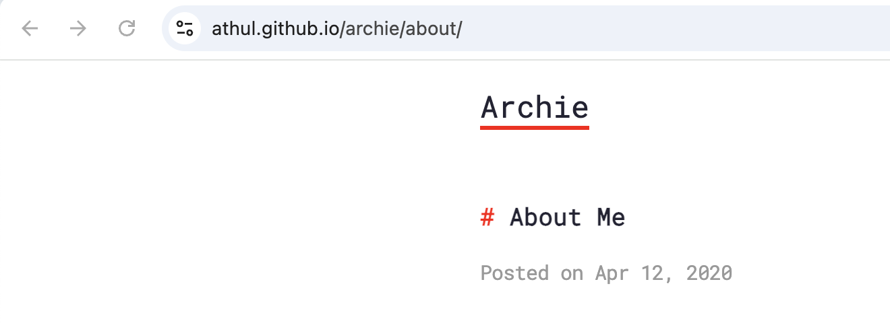

+++
date = '2025-02-12'
draft = false
title = 'Setting up personal blog with Hugo and Github Pages'
tags = ['hugo', 'github']
+++

Recently I've been thinking about setting up my own blog. If you are reading this it means
that I actually did it :slightly_smiling_face:. 

In this post I will try to outline the things I had to do to achieve this.

## Choosing blogging engine

Generally there are two common approaches for hosting a blog: 
- managed blogging platforms like [Medium](https://medium.com/) or [Hashnode](https://hashnode.com/)
- self-hosting using blog engines like [WordPress](https://wordpress.org/) or [Jekyll](https://jekyllrb.com/)

I guess in many cases using managed platform is a great option because it's really simple and allows you to focus
on your content creation without the need to manage underlying hosting infra.

At the same time self-hosting approach gives you practically unlimited flexibility, you are free to choose
any web framework, CSS styling and other related tech such as comments or analytics engine.

I personally found interesting the idea of self-hosting my own blog, first of all, from technical perspective. So this
is the approach I've decided to go with. After a bit of research I found few alternatives for CMS/blogging engines. 
In particular:
- [Jekyll](https://jekyllrb.com/) which is written in Ruby. It's quite popular and is considered to be the default choice for using with Github Pages.
- [Pelican](https://getpelican.com/) which is considered to be Jekyll's alternative implemented in Python.
- [Hugo](https://gohugo.io/) which is quite popular, fast and implemented in Go.

Even though I did want to try self-hosting approach, I still wanted to avoid doing redundant work and learning. So
ideally I wanted to use something that's easy to learn and use, popular, with large user base and having large number of 
plugins available, including themes. 

Initially Pelican seemed like a good choice since it's implemented in Python (which I'm familiar with). But Pelican
seems to be much less popular than the other two options, and, unfortunately, I couldn't find any open source theme
for it that I liked.

Jekyll is very popular on the other hand. But it's implemented in Ruby, and I have zero experience with it. That's why
I've decided to consider the other alternative.

Hugo is advertised as superfast engine (it is indeed). Also, it's based on Go templates, and I do have experience with 
those, since at work I have to deal with Helm charts a lot, and those are based on Go templates as well. Additionally, I was able
to find [nice open-source theme](https://github.com/athul/archie) for it created by [Athul](https://github.com/athul).

So considering the above I've decided to go with [Hugo](https://gohugo.io/).

In essence, [Hugo](https://gohugo.io/) allows generating HTML pages from Markdown input. So it feels quite easy to
write content using your favorite IDE and `*.md` files.

## Figuring out the hosting approach

As mentioned above, as output Hugo produces a set of static assets (html, css, js etc.) needed to render pages of a website. 
But you still need some kind of service to host these assets. Additionally, you need a DNS domain that could be used
for locating and accessing your website.

If possible I wanted to avoid the need to pay neither for assets hosting nor for the DNS domain. This blog is intended
to be quite simple after all, and with very few visitors. 

Therefore, using [Github Pages](https://pages.github.com/) was one of the first thoughts I got when considering 
the hosting alternatives. Github Pages seems like a good option because it practically allows you hosting 
a static website directly from your Github repo. _There is one caveat though:_ turns out you cannot use Github Pages
for a private repo in case you are on a [Free](https://github.com/pricing) plan . But then I've got nothing to hide,
so it's not a deal-breaker for me. 

## Getting your hands dirty with Hugo

First of all, I've decided to read through [Hugo's docs](https://gohugo.io/documentation/). Even though the docs are extensive, 
I found the experience of reading them to be quite tedious (no offence to the authors :sweat_smile:).
Although I guess this is to be expected, because for me working with templating engines was never fun.
Still, if possible, I try to skim through all the docs when learning a new technology just to get better awareness of 
its capabilities. 

In any case, you might want to get to the hands on work right away. For this as a prerequisite it's necessary 
to install Hugo itself. For macOS it's as simple as installing a relevant **brew** package using a command like:
```
brew install hugo
```

Hugo's official documentation provides [installation instructions](https://gohugo.io/installation/) for other platforms as well.

Once Hugo is installed, it should be possible to use Hugo's CLI to set up a new project. I won't go much into detail on this
because the necessary commands are already described [here](https://gohugo.io/getting-started/quick-start/).

Although it makes sense to mention the mechanism for using a 3rd-party Hugo theme. In particular, there are few ways
to use an externally provided theme with your Hugo project:
1. Directly copying theme contents under `themes` directory.
2. Using Git submodules (recommended approach).
3. Using [Hugo Modules](https://gohugo.io/hugo-modules/theme-components/)

The 1st approach provides ability to directly modify the chosen theme to better suit your needs, but with this you are
essentially forking the original theme making it harder to merge updates from theme authors. Additionally, not everyone
(e.g. me) will like to have a bunch 3rd party files in own Git repo. 

The 3rd approach is somewhat advanced. I found the topic on Hugo modules to be poorly documented, and generally I've got
an impression that it's better to avoid this feature unless you are aiming to become Hugo expert.

So this left me with the 2nd approach, that's represented by the following commands:
```
$ mkdir themes
$ cd themes
$ git clone https://github.com/athul/archie.git
```  

After installing the theme it's important to not forget to actually use the theme by setting its name to `theme` property
in your `hugo.yaml` config file:

```yaml
theme: 'archie'
```



After this you can finally get to writing actual website content using `*.md` files. 

## Using custom template for rendering

Hugo relies on a set of conventions for choosing templates to render particular pages. Different template types are 
described [here](https://gohugo.io/templates/types/). At the same time, template resolution for a page is also
influenced by relative location of its base `*.md` content file in the content hierarchy (more details on this [here](https://gohugo.io/content-management/organization/))

Generally page templates are being stored under `layouts/` directory. Although 3rd party themes will already have a set
of templates provided within their `layouts/` subdirectories (e.g. at `themes/archie/layouts/` in my case). 

At the same time, the templates provided by themes can be too generic and not suit well for rendering some specific pages.
For example, I found [Archie](https://github.com/athul/archie) theme to render some irrelevant information when trying to
use it for `/about` page. In particular, the issue I'm talking about can be seen on the [theme's demo website](https://athul.github.io/archie/about/):



Basically, the problem is that it renders _Posted on_ section which is not really relevant to `/about` page. The reason
for this is that by default Hugo uses `single.html` template for the `/about` page, although this template is tailored
for `/post/*` pages first of all.

One of the way to fix this is by creating a custom template for `/about` page. This turned out to be not as
straightforward as I hoped since I couldn't figure out exact file structure required for Hugo to pick the new template up. 
But in the end I've managed to do this with the help of [this thread](https://discourse.gohugo.io/t/create-new-layout-for-an-about-page/6223).
In short the custom template can be created at `layouts/about/single.html`. I've simplified the content of the original
theme's `single.html` template by removing all irrelevant for this case parts. In the end the new template has the
following contents:

```gotemplate
{{ define "main" }}
<main>
    <article>
        <div class="post-container">
            <!-- Main Content -->
            <div class="post-content">
                <div class="title">
                    <h1 class="title">{{ .Title }}</h1>
                </div>
                <section class="body">
                    {{ .Content }}
                </section>
            </div>
        </div>
    </article>
</main>
{{ end }}

```

## Automating build and deployment to Github Pages

This turned out to be pretty simple. Although at first I tried using not the most straightforward approach. 

The approach I chose at first is based on the fact that Github Pages allow hosting `index.html` that's located in
the root of the repo. It's a bit inconvenient to use this approach with Hugo though, cause Hugo generates website
assets into `./public` directory so it would be necessary to copy the content of this dir into the repo root upon
each redeploy. Additionally, it doesn't feel right to keep generated content in the root of your Git repo, although
you can use a dedicated Git branch for this (it's possible to configure Github Pages to serve content from non-master branch).

More convenient approach is described in [official Hugo doc](https://gohugo.io/hosting-and-deployment/hosting-on-github/) 
with instructions for hosting your site using Github Pages. Moreover, 
it contains fully working code defining [Github Workflow](https://docs.github.com/en/actions/writing-workflows/about-workflows)
for building Hugo project and deploying generate assets to Github Pages, that code can be simply copy-pasted.

## Summary

This post by no means aims to provide an extensive tutorial (after all there is official documentation for this), 
but rather outlines key steps and problems I faced when setting up this blog. 

Overall, it took me few evenings to research available options for blog hosting and study Hugo's docs. And then it took
just few hours of actual "coding" to put all the pieces together and deploy a working PoC.
The sources can be found here: https://github.com/thereisnospoon/thereisnospoon.github.io

As a closing note, I would like to give credit to all the people who contributed their time and effort to developing
open-source software allowing to power this blog. Without them, it wouldn't have been possible to set everything up
so quickly.
